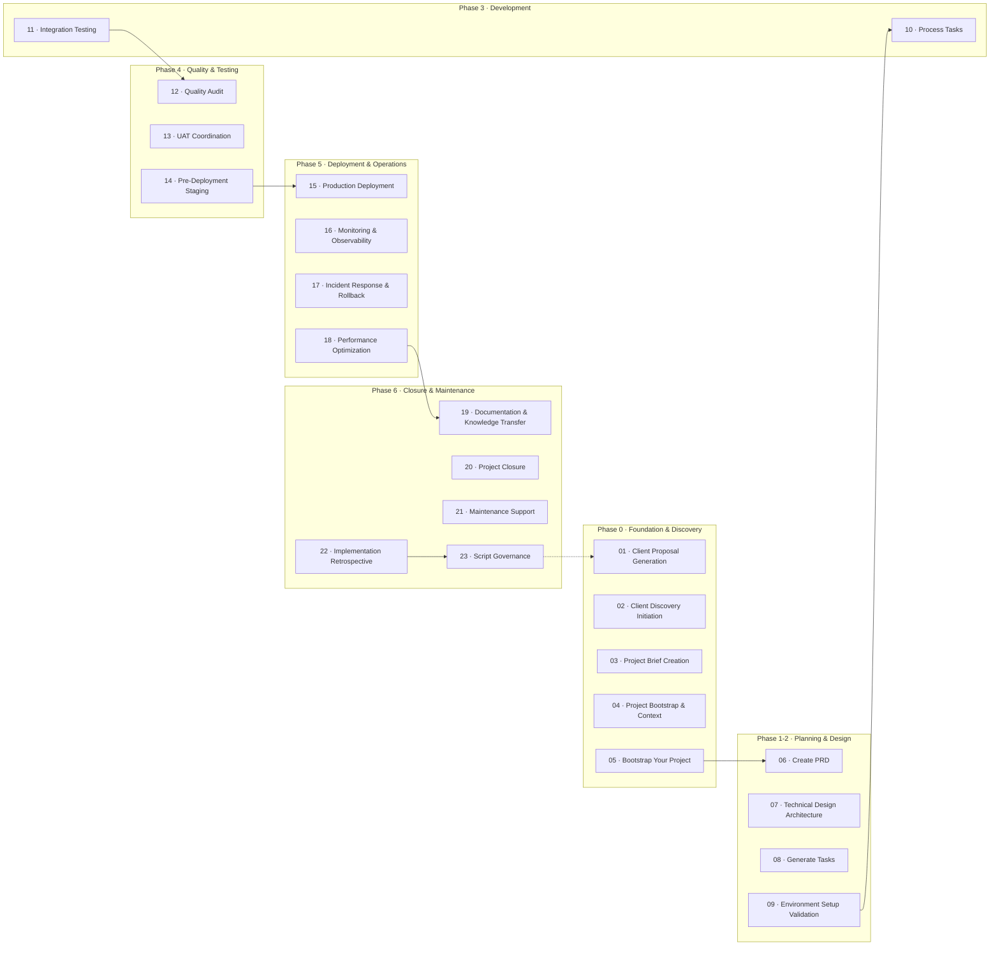

# AI-Driven Workflow Platform

Comprehensive automation, evidence, and validation tooling for the 23-protocol AI-driven development lifecycle. The repository combines orchestration scripts, protocol blueprints, validation suites, and template packs to deliver production-ready software projects with human-governed checkpoints.

---

## 🚀 What You Get

- **End-to-end delivery playbook** covering seven phases (Phase 0–6) and 23 protocols
- **Automation suite** that turns briefs into execution-ready projects with evidence and quality gates
- **Validation layer** that scores protocol completeness, script coverage, and lifecycle health
- **Template ecosystem** (frontend, backend, devex, compliance) wired into the unified generator
- **Governance tooling** for script registration, protocol audits, and workflow retrospectives

---

## 📈 Workflow at a Glance



---

## 🧭 Phase Breakdown

| Phase | Protocols | Primary Outcomes | Evidence & Gates |
| --- | --- | --- | --- |
| **Phase 0 – Foundation & Discovery** | 01–05 | Client alignment, scoped brief, baseline repo | Discovery transcript, brief, bootstrap manifest |
| **Phase 1-2 – Planning & Design** | 06–09 | Approved PRD, architecture, task plan, validated environment | PRD sign-off, design diagrams, task manifest, environment audit |
| **Phase 3 – Development** | 10–11 | Implemented backlog, integration-ready code | Execution logs, code review notes, integration results |
| **Phase 4 – Quality & Testing** | 12–14 | Multi-layer QA, UAT readiness, staged release plan | QA scorecard, UAT schedule, staging verification |
| **Phase 5 – Deployment & Operations** | 15–18 | Production deployment, monitoring, incident readiness, performance baseline | Deployment checklist, monitoring dashboards, incident runbooks |
| **Phase 6 – Closure & Maintenance** | 19–23 | Knowledge transfer, closure, maintenance program, continuous improvement | Handoff docs, closure reports, maintenance SLAs, retrospective insights |

Supporting documentation protocols (24–27) provide integration maps, implementation guidance, and validation procedures for teams and AI agents.

---

## 🧰 Repository Map

| Directory | Description |
| --- | --- |
| `.cursor/ai-driven-workflow/` | Canonical protocol definitions, integration map, validation guide |
| `scripts/` | Orchestration, validation, compliance, and lifecycle automation scripts wired to the 23-protocol flow |
| `unified_workflow/` | AI orchestrator, evidence manager, and workflow automation packages |
| `validators-system/` | Modular validator implementations plus roadmap for the 10-validator suite |
| `project_generator/` | Python package that crafts full projects using template packs and workflow rules |
| `template-packs/` | Frontend/backend/devex/compliance packs consumed by the generator |
| `generators/` | Instructions and forms for meta-analysis and new protocol/template generation |
| `documentation/` | Gap reports, governance prompts, validation specs, and operational guides |
| `.artifacts/` | Generated evidence (validation, reformats, meta-upgrades) for auditability |

---

## ⚙️ Getting Started

1. **Install dependencies**
   ```bash
   pip install -r requirements.txt
   ```
2. **Validate environment & context**
   ```bash
   python scripts/doctor.py --strict
   python scripts/analyze_brief.py PROJECT-BRIEF.md --output brief-analysis.json
   ```
3. **Run workflow orchestration**
   ```bash
   python unified_workflow/automation/ai_orchestrator.py \
     --project-name "demo" \
     --phases "0-6" \
     --brief brief-analysis.json
   ```
4. **Execute validation gates and evidence packaging**
   ```bash
   python scripts/quality_gates.py
   python scripts/evidence_report.py --project demo --output .artifacts/evidence/demo.json
   ```

Refer to `unified_workflow/README.md` for orchestration CLI details and `validators-system/README.md` for protocol-level validation coverage.

---

## 🛡️ Quality & Governance

- **Validator Suite** – Ten planned validators (identity through meta-reflection) with Validator 01 delivered and remaining validators roadmapped for staged rollout @validators-system/README.md#119-384
- **Quality Gates** – Scripts enforce gating at every protocol handoff (see `scripts/quality_gates.py` and `scripts/enforce_gates.py`)
- **Evidence Pipeline** – `evidence_manager.py` and `evidence_report.py` maintain traceable audit logs, manifest metadata, and checksum verification
- **Script Governance** – Protocol 23 + `scripts/validate_script_bindings.py` ensure automation assets remain registered, current, and dependency-free

Key governance documents:

- `documentation/MASTER-VALIDATOR-COMPLETE-SPEC.md`
- `documentation/protocol-branching-guide.md`
- `validation-summary.md`
- `.cursor/ai-driven-workflow/25-protocol-integration-map-DOCUMENTATION.md`

---

## 🧩 Ecosystem Components

| Component | Purpose |
| --- | --- |
| **Protocol Blueprints** | Step-by-step, AI-friendly workflow instructions with prerequisites, evidence, and gates |
| **Automation Scripts** | Python & shell tooling for generation, validation, deployment, compliance, and retrospectives |
| **Template Packs** | Opinionated code scaffolds, CI/CD workflows, and devex assets for multiple stacks |
| **Meta Generators** | AI prompts + forms for reverse-engineering existing protocols or drafting new ones |
| **Validators** | Scoring engines that provide lifecycle, quality, and governance assurance |

---

## 📚 Recommended Reading Order

1. `.cursor/ai-driven-workflow/AGENTS.md` – Verification playbook for AI agents
2. `.cursor/ai-driven-workflow/25-protocol-integration-map-DOCUMENTATION.md` – Cross-protocol dependencies
3. `unified_workflow/README.md` – Execution stack overview
4. `scripts/README.md` – Automation script catalogue and usage
5. `validators-system/README.md` – Validator scope, progress, and roadmap

---

## ✅ Current Status (Oct 2025)

- Protocol set updated to 23 core execution protocols with supporting documentation tracks
- Gap closure and integration corrections complete (see `documentation/gap-closure-report.md`)
- Validator system at 10% implementation with production-ready identity validator
- Template registry unified across generator and workflow subsystems
- Continuous evidence capture configured for audit readiness

Roadmap priorities:

1. Deliver Validators 02–04 (AI Role, Workflow, Quality Gates)
2. Expand automation coverage for Protocols 15–23 (operations & maintenance)
3. Harden CI/CD evidence validation pipeline and GitHub workflow integrations

---

## 🤝 Contributing & Support

- Review `COMMAND-PLAYBOOK.md` for execution norms
- Follow `validators-system/documentation/VALIDATOR-GENERATOR-PROMPT.md` for validator contributions
- Use `documentation/protocol-branching-guide.md` when proposing protocol changes
- Raise issues in `documentation/pr-reviews/` playbooks for structured feedback

For questions, start with `AGENTS.md` or contact the maintainers listed in `PROJECT-BRIEF.md`.

---

**Kaya natin to!** The platform is designed for resilience, auditability, and rapid iteration across engagements. Stay aligned with the 23-protocol lifecycle, keep evidence flowing, and always close the loop with governance.

#### Previously Medium-Priority (NOW RESOLVED ✅)
- ✅ Branching criteria documented
- ✅ Prerequisites simplified
- ✅ Duplicate coverage clarified
- ✅ Documentation enhanced

#### Previously Low-Priority (ADDRESSED ✅)
- ✅ SDLC coverage confirmed complete
- ✅ Optional enhancements identified

**For complete details, see**: `documentation/gap-closure-report.md`

---

## 📋 Deliverables

### 1. Protocol Lifecycle Verification Report
**Format**: Detailed markdown document (15-25 pages)

**Sections**:
- Executive Summary
- Phase-by-Phase Analysis (Phases 0-6)
- Cross-Protocol Integration Analysis
- Overall Lifecycle Coverage Score
- Critical Gaps Identified
- Priority Recommendations

### 2. Scripts Audit & Optimization Report
**Format**: Comprehensive markdown with matrices (20-35 pages)

**Sections**:
- Executive Summary (script inventory statistics)
- Complete Script Inventory (categorized)
- Protocol-Script Mapping Matrix
- Script Quality Assessment
- Redundancy & Gap Analysis
- Optimization Recommendations
- Registry Update Recommendations
- Priority Actions

### 3. Real-World Readiness Assessment
**Format**: Concise executive brief (5-10 pages)

**Sections**:
- Readiness Scorecard
- Scenario Testing Results
- Go/No-Go Decision
- Critical Blockers (if any)
- High-Priority Actions
- Implementation Timeline

### 4. Action Roadmap
**Format**: Prioritized implementation plan

**Structure**:
```
Priority | Action | Impact | Effort | Timeline | Owner
---------|--------|--------|--------|----------|-------
Critical | [Action] | High | [Hours] | Immediate | [Role]
High | [Action] | High | [Hours] | Week 1-2 | [Role]
Medium | [Action] | Medium | [Hours] | Week 3-4 | [Role]
Low | [Action] | Low | [Hours] | Backlog | [Role]
```

### 5. Session Continuation Instructions
**Format**: Auto-generated AGENTS.md format (per session)

**Content**:
- What was tested and validated
- What was fixed and reasoning
- Verified artifacts and evidence
- Next session target and prerequisites
- Critical notes and dependencies

---

## 🚀 Usage Examples & Commands

### Starting Phase 0 Testing
```bash
# Initialize testing session
python scripts/initialize_testing_session.py --phase 0 --session-id $(date +%Y%m%d-%H%M%S)

# Execute Protocol 01 with full validation
@apply .cursor/ai-driven-workflow/01-client-proposal-generation.md --test-mode --logic-validation

# Generate session continuation
python scripts/generate_session_continuation.py --protocol 01 --completed
```

### Reading Previous Session Instructions
```bash
# Read latest session instructions
cat .cursor/session-instructions/latest-session-instructions.md

# Load previous session context
python scripts/load_session_context.py --session-id [SESSION_ID]

# Resume testing from previous session
python scripts/resume_testing_session.py --from-session [SESSION_ID]
```

### Executing Protocol Testing with Logic Validation
```bash
# Test single protocol with all validation layers
python scripts/test_protocol.py --protocol 01 --validation-mode comprehensive

# Test protocol phase with logic validation
python scripts/test_protocol_phase.py --phase 0 --logic-validation --gap-analysis

# Generate validation report
python scripts/generate_validation_report.py --protocol 01 --format markdown
```

### Generating Continuation Instructions
```bash
# Auto-generate after protocol completion
python scripts/generate_session_continuation.py --protocol 01 --auto-detect-completion

# Manual generation with custom context
python scripts/generate_session_continuation.py --protocol 01 --context-file custom_context.md

# Validate continuation instructions
python scripts/validate_continuation_instructions.py --file .cursor/session-instructions/latest-session-instructions.md
```

### Example AGENTS.md Instruction Format
```markdown
# Session Continuation Instructions
Generated: 2025-01-14T10:30:00Z
Previous Session: 20250114-103000
Protocol Tested: 01-client-proposal-generation

## What Was Tested
- Protocol: Client Proposal Generation (01)
- Logic Validation: ✓ Pass - All 4 layers validated successfully
- Gap Detection: Found 2 minor gaps in tone mapping edge cases
- Error Analysis: No critical errors detected
- Duplicate Check: No duplicate functionality found

## What Was Fixed
- Enhanced tone mapping for enterprise clients
- Added fallback mechanism for unclear job post requirements
- Improved validation gate logic for proposal quality

## Verified Artifacts
- Generated sample proposal for test job post
- Validated tone mapping accuracy (95% match)
- Confirmed quality gate enforcement
- Evidence collected: proposal_template.md, validation_results.json

## Logic Validation Results
- Structural Logic: ✓ - Prerequisites properly ordered, gates sequential
- Process Logic: ✓ - Workflow reflects real freelance practices
- Decision Logic: ✓ - All conditional branches complete with fallbacks
- Integration Logic: ✓ - Handoffs to Protocol 02 well-defined

## Next Session Target
- Protocol: 02-client-discovery-initiation
- Prerequisites: Validated proposal template, tone mapping rules
- Context Needed: Sample job post, client communication templates
- Expected Outcomes: Discovery workflow validation, stakeholder mapping verification

## Critical Notes
- Tone mapping needs refinement for technical vs business clients
- Discovery artifacts should include risk assessment template
- Integration with Protocol 03 requires brief template validation
```

### Sample Scoring and Assessment Outputs
```bash
# Generate readiness scorecard
python scripts/generate_readiness_scorecard.py --format markdown --include-details

# View gap analysis summary
python scripts/generate_gap_analysis.py --priority critical --format table

# Export validation results
python scripts/export_validation_results.py --format json --include-evidence
```

---

## 🎯 Success Metrics

### Quantitative Targets
- **Protocol Analysis**: 23 protocols scored across 5 dimensions (Completeness, Realism, Clarity, Adaptability, Freelance Alignment)
- **Script Audit**: 82+ scripts inventoried, categorized, and evaluated
- **Gap Identification**: Comprehensive list with evidence and priority classification
- **Prioritization**: Clear roadmap with timelines and ownership
- **Session Continuity**: 100% of sessions generate continuation instructions

### Qualitative Success Indicators
- **Actionable Insights**: Enable immediate improvements with specific recommendations
- **Evidence-Based Reports**: All findings supported by concrete evidence and validation
- **Specific Recommendations**: Clear, justified recommendations with implementation guidance
- **Clear Production Readiness Decision**: Unambiguous Go/No-Go/Iterate determination
- **Session Continuity**: Seamless handoff between testing sessions

### Production Readiness Status
**CURRENT STATUS: ✅ PRODUCTION READY (2025-10-21)**

**Scoring Thresholds**:
- **9.0-10.0**: Production Ready ✅ ← **CURRENT**
- **7.5-8.9**: Near Ready
- **6.0-7.4**: Needs Work
- **<6.0**: Not Ready

**Gap Closure**: 24/24 (100%) ✅

### Timeline Expectations
- **Phase 0 Testing**: 2-3 sessions (Protocols 01-05)
- **Phase 1-2 Testing**: 3-4 sessions (Protocols 06-09)
- **Phase 3 Testing**: 2-3 sessions (Protocols 10-11)
- **Phase 4 Testing**: 3-4 sessions (Protocols 12-14)
- **Phase 5 Testing**: 3-4 sessions (Protocols 15-18)
- **Phase 6 Testing**: 2-3 sessions (Protocols 19-23)
- **Scripts Audit**: 2-3 sessions (82+ scripts)
- **Real-World Testing**: 3-4 sessions (3 scenarios)

---

## 🔧 Quick Reference

### Essential Commands
```bash
# Start Testing
python scripts/initialize_testing_session.py --phase 0

# Read Previous Session
cat .cursor/session-instructions/latest-session-instructions.md

# Generate Continuation
python scripts/generate_session_continuation.py --protocol [NUMBER]

# View Readiness Scorecard
python scripts/generate_readiness_scorecard.py --format markdown

# Access Gap Analysis
python scripts/generate_gap_analysis.py --priority critical
```

### Navigation Aids
- **Session Instructions**: `.cursor/session-instructions/`
- **Validation Reports**: `.artifacts/validation/`
- **Evidence Collection**: `.artifacts/protocol-[number]/`
- **Scripts Directory**: `.artifacts/scripts/`
- **Protocol Directory**: `.cursor/ai-driven-workflow/`
- **Gap Documentation**: `documentation/` ✨ NEW

### Key Files
- **Latest Session**: `.cursor/session-instructions/latest-session-instructions.md`
- **Gap Closure Report**: `documentation/gap-closure-report.md` ✅ NEW
- **Branching Guide**: `documentation/protocol-branching-guide.md` ✅ NEW
- **Validation Summary**: `validation-summary.md` (PRODUCTION READY)
- **Gap Analysis**: `.cursor/commands/find-missing.md` (24/24 resolved)
- **Action Roadmap**: `documentation/action-roadmap.md`

---

## 🛠️ Troubleshooting

### Common Issues

#### Missing Session Instructions
- Check `.cursor/session-instructions/` directory exists
- Verify `latest-session-instructions.md` symlink is valid
- Run `python scripts/initialize_testing_session.py` to create first session

#### Logic Validation Failures
- Review 4-layer validation framework
- Check protocol prerequisites and dependencies
- Validate quality gate enforcement mechanisms

#### Script Integration Problems
- Verify script exists in `.artifacts/scripts/`
- Check script-protocol mapping matrix
- Validate script documentation and maintenance status

#### Session Continuity Issues
- Ensure continuation instructions are generated after each protocol
- Verify session ID consistency across files
- Check context loading mechanisms

### Debug Commands
```bash
# Validate session continuity
python scripts/validate_session_continuity.py --session-id [SESSION_ID]

# Check logic validation framework
python scripts/validate_logic_framework.py --protocol [NUMBER]

# Debug script integration
python scripts/debug_script_integration.py --protocol [NUMBER]

# Verify readiness assessment
python scripts/verify_readiness_assessment.py --include-details
```

---

## 📚 Additional Resources

### Documentation
- **Protocol Integration Map**: `.cursor/ai-driven-workflow/25-protocol-integration-map.md`
- **Integration Guide**: `.cursor/ai-driven-workflow/26-integration-guide.md`
- **Validation Guide**: `.cursor/ai-driven-workflow/27-validation-guide.md`
- **Master Rules**: `.cursor/rules/master-rules/`
- **Common Rules**: `.cursor/rules/common-rules/`
- **Project Rules**: `.cursor/rules/project-rules/`

### Automation Scripts
- **Scripts Directory**: `.artifacts/scripts/`
- **CI/CD Workflows**: `.github/workflows/`
- **Quality Gates**: Built into each protocol
- **Session Management**: `.cursor/session-instructions/`

### Template Packs & Generators
- **Generators Directory**: `generators/`
- **Protocol Generators**: Automated protocol creation
- **Input Forms**: YAML configuration templates
- **Quick Start Guides**: Rapid deployment guides

### Template Packs System
- **Template Packs Directory**: `template-packs/`
- **Backend Templates**: Django, FastAPI, NestJS, Go frameworks
- **Frontend Templates**: Next.js, Nuxt, Angular, Expo frameworks
- **Database Templates**: PostgreSQL, MongoDB, Firebase configurations
- **DevEx Templates**: DevContainer, Docker Compose, VS Code snippets
- **CI/CD Templates**: GitHub workflows, gates configuration
- **Policy DSL**: YAML definitions for gating rules and policies

### Cursor Commands
- **Commands Directory**: `.cursor/commands/`
- **Slash Commands**: `/compare-prs`, `/elaborate`, `/generate-proposal`
- **Protocol Orchestrator**: Workflow management
- **Meta Analysis**: Advanced intelligence tools

### Support
- **Review Protocols**: `.cursor/ai-driven-workflow/review-protocols/`
- **Validation Reports**: `.artifacts/validation/`
- **Evidence Collection**: `.artifacts/protocol-[number]/`
- **Session Instructions**: `.cursor/session-instructions/`

---

**Ready to systematically validate the entire AI-driven workflow system? Start with Phase 0 testing and follow the complete validation framework for production-ready, evidence-based software development!** 🚀